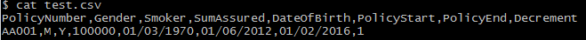
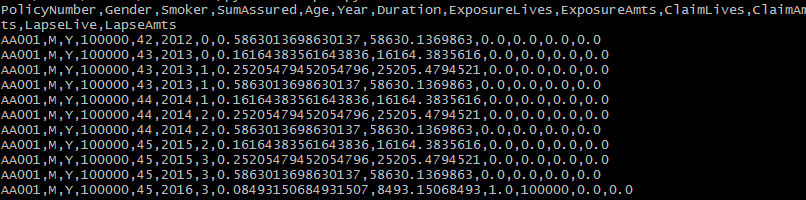

# leap
Life Experience Analysis in Python

### Description
Actuarial life experience analysis exposure calculations coded in Python.  The program calculates the exposure by lives and amounts over a policy lifetime, by tracking the age, duration and calendar years, over the period.
The inputs and output formats are in CSV format. 

### Technology
Requires Python 3.5

### Running the unit test
To run the included unit tests, type the following in the command line:

    python leap.py

### Running an example
We can run an example of the exposure calculation based on input data, test.csv. This input file consists of various fields as shown below.

To run the exposure calculations, type the following in the command line:

    python example.py

We would get the results shown below.

